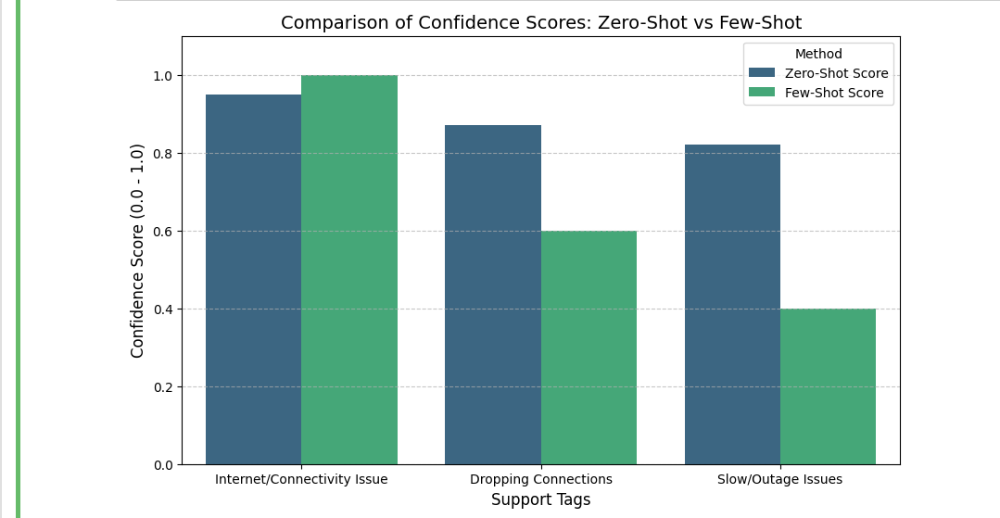

# Auto Tagging Support Tickets Using LLM

## 📌 Project Overview
This project demonstrates how Large Language Models (LLMs) can be used to automatically classify and tag customer support tickets using prompt engineering techniques.

The system compares Zero-Shot and Few-Shot Prompting using a lightweight open-source model:

Qwen2.5-1.5B-Instruct

The model generates the top 3 most relevant tags with confidence scores for each support ticket.

## 🎯 Objective
- Automatically analyze free-text support tickets  
- Generate semantic tags using an LLM  
- Compare Zero-Shot vs Few-Shot prompting  
- Evaluate how examples improve tagging quality  
- Visualize confidence score differences  

## 🧠 Concepts Used
- Large Language Models (LLMs)  
- Prompt Engineering  
- Zero-Shot Learning  
- Few-Shot Learning  
- NLP-based Ticket Classification  
- Confidence Scoring  
- Data Visualization  

## 🛠️ Technologies Used
- Python  
- HuggingFace Transformers  
- Qwen2.5-1.5B-Instruct  
- Pandas  
- Matplotlib  
- Seaborn  
- Google Colab  

## 🚀 Model Used
Qwen2.5-1.5B-Instruct is a lightweight instruction-tuned model used because:
- It performs well on prompt-based NLP tasks  
- It runs efficiently on Google Colab  
- It supports instruction-following behavior  
- It is much lighter than models like Mistral-7B  

HuggingFace Link:
https://huggingface.co/Qwen/Qwen2.5-1.5B-Instruct  

## 🟢 Zero-Shot Prompting
In zero-shot prompting, the model is given only the instruction without examples.

Example:
My internet is not working and connection keeps dropping

Output:
internet connectivity issues - 0.95  
network problem - 0.87  
technical support needed - 0.82  

## 🟡 Few-Shot Prompting
In few-shot prompting, the model is given examples to learn pattern matching.

Example:
Ticket: Printer not working  
Tags: printer issue - 0.95, hardware failure - 0.8, ink problem - 0.7  

Ticket: Internet is slow  
Tags: network issue - 0.9, connectivity - 0.85, bandwidth problem - 0.8  

Output:
internet outage - 1.0  
router malfunction - 0.6  
ISP issues - 0.4  

## 📊 Visualization
The project compares Zero-Shot and Few-Shot outputs using:
- Matplotlib  
- Seaborn  

A grouped bar chart is used to show confidence score differences.

Below is the comparison of Zero-Shot vs Few-Shot performance:

## 📈 Key Findings
Zero-Shot:
- Works without examples  
- Gives general predictions  
- Less consistent scoring  

Few-Shot:
- More accurate predictions  
- Better understanding of context  
- More realistic confidence scores  

## 🔍 Analysis
Zero-shot prompting gives broad but less structured outputs.

Few-shot prompting improves accuracy by guiding the model with examples, making outputs more aligned with real-world ticket classification.

## 📌 Use Cases
- IT Helpdesk Automation  
- Customer Support Systems  
- Ticket Routing Systems  
- CRM Automation  
- Email Classification  

## 🔮 Future Improvements
- Fine-tuning on real support datasets  
- Streamlit web interface  
- API deployment using FastAPI  
- Real-time ticket classification system  
- Database integration  

## 👨‍💻 Author
Laksh Kumar  
Computer Science Student | Machine Learning & NLP Enthusiast  

## ⭐ Acknowledgements
- HuggingFace Transformers  
- Qwen Team  
- Google Colab  
- Open-source NLP community  

## 📜 License
This project is for educational and internship demonstration purposes.
